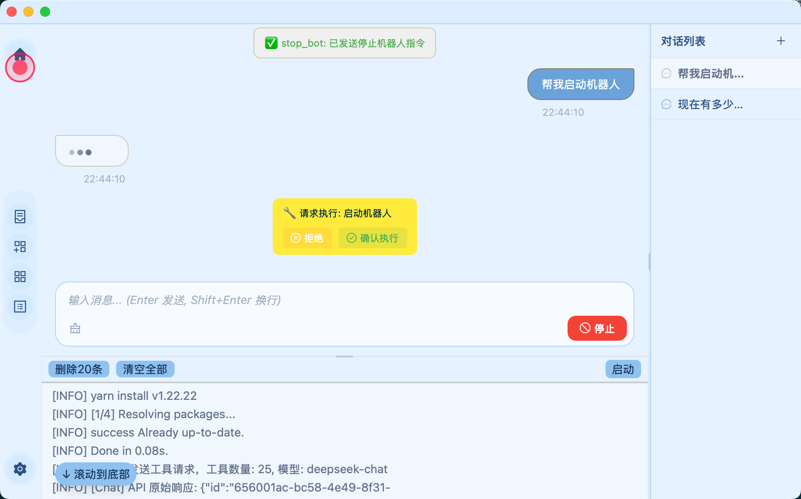

# 阿柠檬桌面

AI智能桌面，你的机器人桌面何必仅是一个启动器。

[点击下载 https://github.com/lemonade-lab/alemondesk/releases](https://github.com/lemonade-lab/alemondesk/releases)



其功能包括且不仅限于以下功能：

- 对话式控制应用

- 一键启动机器人

- 时时日志监控

- 支持开发者通过开发扩展(webview+command等)提升用户体验

- 可通过git或npm快速安装扩展

- 自动加载缓存依赖&自动启动扩展器

- 个性化主题（可导入导出）

⚠️ 非团队所推荐的扩展，不保证其安全性，在使用第三方扩展时，请注意是否是存在非法行为。

## 配置AI

在应用的设置-AI+中，进行以下示例配置

### DeepSeek

- api_url

```
https://www.deepseek.com/chat/completions
```

- api_key

访问 https://www.deepseek.com/ 打开API开放平台创建 API Key

- model

```
deepseek-chat
```

### Ollama

更多请访问 https://ollama.com/

- api_url

```
http://localhost:11434/api/chat
```

## 关于扩展开发

阅读[开放扩展开发指南🔗](https://alemonjs.com/docs/alemonjsDocs/open/desktop)